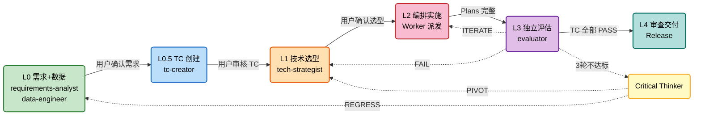

# AutoAgent

> 自动迭代 Agent 系统 — 让 Agent 们产出代码，而不是你自己写。

AutoAgent 是一个**指挥部**：接收需求 → 调研 → 选型 → 实施 → 评估 → 交付，五层门控管理项目全生命周期。基于 [Claude Code](https://docs.anthropic.com/en/docs/claude-code) 插件体系构建，通过 `/aa` 系列命令驱动。

## 核心理念

AutoAgent 不直接产出代码。它编排多个 Agent（Worker）协作完成项目，Leader 负责决策和验证。8 条核心原则（[soul.md](soul.md)）贯穿所有决策：

1. **数据驱动** — 选方案靠 POC 对比，不靠直觉
2. **验证即完成** — 没有验证证据，不允许声称完成
3. **简洁优于复杂** — 能删就删，Markdown 胜过 JSON Schema
4. **不可跳层** — Layer 0→1→2→3→4，每层门控通过才进下一层
5. **没有调查，不准修复** — Bug 修复必须先陈述根因
6. **先查后写** — 先搜索已有方案，再动手写代码
7. **信任但验证** — 子代理会撒谎，Leader 必须验证产物
8. **场景化自治** — 错误代价决定介入程度

## 五层流程



> **每层产物**: L0 → `REQUIREMENTS.md` + `DATA_QUALITY.md` | L0.5 → TC 用例 + 覆盖矩阵 | L1 → `TECH_SELECTION.md` + `RESEARCH_REPORT.md` | L2 → `Plans.md` + Worker 代码 | L3 → `EVAL_REPORT.md` (TC 逐条) | L4 → README + Release 包

每层之间有**门控**（`/aa-gate`），条件不满足则不能进入下一层。迭代 3 轮不达标时触发 **Critical Thinker** 战略重评，四路由决策：

| 路由 | 含义 | 回退目标 |
|------|------|---------|
| **PERSIST** | 继续当前方向，附调整建议 | → Layer 2 |
| **PIVOT** | 同层换方案 | → Layer 1 |
| **REGRESS** | 需求/数据有问题 | → Layer 0 |
| **ABORT** | 当前约束下不可达 | → 向用户报告 |

## 快速开始

### 前置条件

- [Claude Code](https://docs.anthropic.com/en/docs/claude-code) CLI
- [ClawTeam](https://github.com/Chachamaru127/clawteam)（多 Agent 协作，可选）
- [OpenViking](https://github.com/szsip239/OpenViking)（跨项目经验记忆，可选）

### 安装

```bash
# 克隆仓库
git clone https://github.com/szsip239/autoagent.git
cd autoagent

# 注册为 Claude Code 本地插件
# 在 .claude/settings.json 中添加：
# { "localPlugins": ["./autoagent-plugin"] }
```

### 使用

在 Claude Code 中：

```
/aa                  # 唯一入口 — 无项目时初始化，有项目时显示状态
/aa-research         # Layer 1: 技术调研 + POC + 选型
/aa-plan             # Layer 2: 编排规划（进入 Plan 模式）
/aa-spawn            # Layer 2: Worker 派发
/aa-eval             # Layer 3: 独立评估
/aa-ship             # Layer 4: 审查 + 交付
/aa-gate check 1     # 检查指定层门控条件
/aa-gate pass 1      # 确认通过门控
```

## 架构

```
autoagent/
├── autoagent-plugin/          # Claude Code 插件
│   ├── skills/                # 7 个 /aa 系列命令
│   ├── agents/                # 6 个 Agent 注册（frontmatter）
│   └── hooks/                 # 4 个自动化 Hook
├── agents/core/               # Agent 详细 prompt（完整 workflow）
├── scripts/                   # 核心脚本（gate-check 等）
├── templates/                 # 目标项目模板（12 个）
├── docs/                      # 详细文档 + ISSUES 分卷
└── references/                # 标杆调研资料
```

### 6 个核心 Agent

| Agent | 层 | 职责 |
|-------|-----|------|
| **requirements-analyst** | L0 | 需求深挖（5 个必问问题）→ REQUIREMENTS.md |
| **data-engineer** | L0 | 数据质量 5 维检查 → DATA_QUALITY.md |
| **tc-creator** | L0.5 | 三问法生成 TC + 覆盖矩阵自检 |
| **tech-strategist** | L1 | 4-Phase 调研选型（三路搜索→POC→评判） |
| **evaluator** | L3 | 逐 TC 独立验证（API/数据/截图/交互/网络） |
| **critical-thinker** | 战略层 | 迭代死循环时批判性重评（PERSIST/PIVOT/REGRESS/ABORT） |

### 4 个自动化 Hook

| Hook | 触发 | 功能 |
|------|------|------|
| **session-init** | SessionStart | 检测活跃项目 + 状态提示 |
| **safety-check** | PreToolUse(Bash) | 拦截破坏性命令 + 密钥泄露 |
| **skill-tracker** | PostToolUse(Skill) | 记录 Skill 调用 |
| **session-end** | Stop | 检查必选 Skills + notepads 更新 + ClawTeam 同步 |

## 暂停协议

以下 10 个场景 Agent **不可自动决策**，必须暂停等待用户：

1. 需求确认（Layer 0）
2. 技术选型确认（Layer 1）
3. 评估指标"接近"但不达标
4. 数据质量红色问题
5. 成本超预算
6. 安全风险（破坏性命令/密钥泄露）
7. Worker 新任务必须先注册看板
8. TC 审核（Layer 0.5）
9. 评估通过但有未通过 TC
10. Critical Thinker 路由确认

## 设计借鉴

AutoAgent 的设计综合了 5 个标杆项目的实践（详见 [references/](references/)）：

| 来源 | 借鉴 |
|------|------|
| [Karpathy autoresearch](references/research-autoresearch.md) | 评估不可篡改、Git 即状态机、固定预算实验 |
| [gstack](references/research-gstack.md) | ETHOS 哲学、Fix-First Review、Verification Gate |
| [OmO](references/research-omo.md) | Wisdom Accumulation、Momus 量化审查 |
| [Ruflo](references/research-ruflo.md) | Claims 状态机、门控正则、3-Tier 模型路由 |
| [Anthropic Harness](references/research-anthropic-harness.md) | GAN 博弈架构、自评偏差铁律、承重组件审视 |

## 已知问题

61 个 ISS 跟踪，35 个已修复，18 个待实战验证。详见 [ISSUES.md](ISSUES.md)。

关键未解决项：
- **ISS-045 [P0]**: 验证驱动开发（VDD）闭环 — Agent 自认完成但交付物不达预期
- **ISS-053 [P1]**: Critical Thinker 机制 — 迭代死循环时的战略层重评
- **ISS-050/051 [P1]**: TC 先行协议 + 硬阈值门控

## License

MIT
